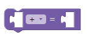

JSON array 스타일로 블록 정의하기
==============================================
[지난 문서](https://github.com/VleuDive/Blockly_markdown_docs/blob/master/javascript_define_block.md)에서는 처음부터 끝까지 Javascript 스타일로 블록을 정의하는 방법을 살펴보았습니다. 이번 문서에서는 블록을 정의하는 또 다른 방법인 **JSON array를 사용하는 방법** 을 다루겠습니다. 이 방법은 Google Blockly 공식 가이드에서도 더 권장하는 방법이고, 익숙해진다면 Javascript만 사용한 스타일에 비해 훨씬 보기 좋고 이해하기가 쉽습니다. 또한 JSON이 널리 이용되는 데이터 표준 중 하나이기 때문에, 표준과의 호환성을 생각하면 이 방법을 사용하는 것이 더 낫습니다.

정의할 블록
---------------------------------------


정의할 블록은 지난 문서와 같은 **Short_math** 블록입니다. 지난 문서에서 Javascript 스타일로 정의한 것과 역할도, 모양도 모두 같으며, 블록을 정의하는 방식만 살짝 달라집니다.

블록 정의 코드 
---------------------------------------
JSON array를 사용하여 Short_math를 정의하는 코드는 다음과 같습니다.

```javascript
Blockly.defineBlocksWithJsonArray(
    [
                {
                    "type": "short_math",
                    "message0": "%1 %2 = %3 %4",
                    "args0": [
                        {
                            "type": "input_value",
                            "name": "a",
                            "check": "Number"
                        },
                        {
                            "type": "field_dropdown",
                            "name": "select",
                            "options": [
                                [
                                    "+",
                                    "+"
                                ],
                                [
                                    "*",
                                    "*"
                                ],
                                [
                                    "-",
                                    "-"
                                ],
                                [
                                    "/",
                                    "/"
                                ]
                            ]
                        },
                        {
                            "type": "input_dummy"
                        },
                        {
                            "type": "input_value",
                            "name": "b",
                            "check": "Number"
                        }],
                    "inputsInline": true,
                    "nextStatement":null,
                    "previousStatement":null,
                    "colour": 260,
                    "tooltip": "Short version of arithmetic calculations",
                    "helpUrl": ""
                },
    ]
);
```

코드를 하나하나 분석해 보겠습니다.

### Block 정의 함수

Block 정의 함수는 다음과 같은 형태를 하고 있습니다.


```javascript
Blockly.defineBlocksWithJsonArray( /*JSON array*/);
```

Javascript 형태로 정의할 때보다 매우 간단해진 것을 볼 수 있습니다. 이 함수가 받는 파라미터의 형태는 JSON array이며, 이 array 안에 얼마든지 많은 블록을 정의할 수 있습니다. 그렇기 때문에 이 함수는 전체 파일 내에서 한 번만 호출해도 되며, 한 번의 호출로 여러 블록을 정의할 수 있습니다. 주의하실 점은, JSON array 형태로 블록을 정의한다고 해서 **파일 내에 JSON array만 달랑 정의하거나, 블록 정의 파일 자체를 .json 파일로 만들면 안 된다**는 것입니다. 블록 정의 파일은 .js 파일이 되어야 하며, JSON array를 활용하는 정의 방식에서도 이 함수를 이용해 블록의 정의가 담겨 있는 JSON array를 받는 식으로 블록 정의를 해야 합니다. 그렇게 하지 않으면 새로운 block이 전혀 인식되지 못합니다.

### JSON array의 형태
JSON은 기본적으로 중괄호 { } 안에 "key":"value" 쌍의 연속으로 하나의 객체를 정의합니다.

JSON array는 이런 JSON 객체가 여러 개 모인 것으로, [] 으로 표현합니다.

위 코드의 Blockly.defineBlocksWithJsonArray() 함수의 파라미터는 언뜻 보면 매우 길어 보이지만 실제로는 다음과 같은 구조를 하고 있습니다.

```json
[
  {
    "블록 1의 속성 1": "블록 1의 값 1",
    "블록 1의 속성 2": "블록 1의 값 2",
                      .
                      .
                      .
  },
  {
    "블록 2의 속성 1": "블록 2의 값 1",
    "블록 2의 속성 2": "블록 2의 값 2",
                      .
                      .
                      .
  },
  .
  .
  .
]
```

즉 배열 안의 객체(중괄호로 묶인 범위) 하나가 블록 하나를 나타낸다고 할 수 있습니다. 

### Type과 Message

JSON array는 다음과 같이 시작합니다.

```json
 "type": "short_math",
 "message0": "%1 %2 = %3 %4",
```

**type**은 **블록의 이름**입니다. 뒤에 XML 구문 수정을 통해 workspace에 블록을 추가할 때 이 type을 사용하게 됩니다. Javascript 스타일로 정의했을 때는 Blockly.Blocks["short_math"] 처럼 대괄호 속에 이 이름이 들어가 있었습니다. JSON array 방식의 경우 같은 요소를 "type"이라는 이름으로 정의합니다. Type이라는 영단어의 뜻 때문에 헷갈릴 수 있으니 주의하세요.

**message0**에는 해당 블록에 표시될 string을 지정합니다. 여기에 지정된 string의 형식이 사용자가 블록을 구분할 때 쓸 블록 라벨입니다. message'0' 이라고 숫자가 붙어 있는 것은, 필요에 따라 message1, message2 등으로 여러 개의 message를 동시에 정의할 수도 있기 때문입니다. 

message0에 지정되는 string은 %1, %2 와 같은 표기를 통해 input 또는 field 등이 들어갈 자리를 확보하고 있다는 것도 특징입니다. 이 key 바로 아래에 정의될 "args0" 배열에 들어 있는 input이 위에서부터 순서대로 %1, %2,... 위치에 들어간다고 할 수 있습니다. Javascript 방식에서 label을 붙일 때는 반드시 dummy input을 만든 뒤 dummy input의 field로 해당 label을  추가해 주는 방법을 쓰는 반면, JSON의 경우 저런 식으로 %로 표시된 자리 사이에 오는 string은 모두 label 취급이기 때문에 label의 정의가 더욱 쉽습니다. 물론, 저렇게 쓰지 않고 %로 표시된 자리에 label field를 할당해 주는 방법도 사용할 수 있습니다. 

주의하실 점은, **%로 표시된 자리의 개수와 실제 input의 개수가 맞지 않으면 에러가 발생한다**는 것입니다. Message0에 %3번까지 자리를 지정해 놓았다면 input도 반드시 3개가 정의되어야 합니다.

### Input 정의

그 다음부터는 이 블록에 들어갈 input을 차례대로 정의해 줍니다. Input도 하나의 JSON array 안에 묶어서 받는데, 그 형태는 이렇습니다.

```json
[
  {
    "input 1의 속성 1": "input 1의 값 1",
                      .
                      .
                      .
  },
  {
    "input 2의 속성 1": "input 2의 값 1",
    "input 2의 속성 2": "input 2의 값 2",
                      .
                      .
                      .
  },
  .
  .
  .
]
```

이 배열은 "args0"이라는 키에 할당됩니다. Input 목록 자체를 배열로 만들어서 할당하기 때문에, input 여러 개를 정의하더라도 Javascript 형식으로 정의할 때에 비해 더 간결하고 가독성이 좋아집니다.

이제 각 input 객체를 하나하나 분석해 보겠습니다.

첫 번째 input은 이렇게 정의되어 있습니다.

```json
{
  "type": "input_value",
  "name": "a",
  "check": "Number"
}
```

먼저 **type**은 문자 그대로 이 input의 '종류'를 나타내고 있습니다. **블록 정의 맨 위에 쓰이는, 블록 이름을 나타내는 type과는 그 의미가 다릅니다.** 오히려 이쪽이 type이라는 단어의 원래 뜻에 가깝게 쓰이고 있지요. 이 type에는 input_value, input_dummy, input_statement, 그 외 다양한 field의 분류명을 지정해 줍니다.

블록 전체 정의에서 쓰는 type과 같은 의미로 쓰이는 key는 바로 **name**입니다. 이 name에 할당된 이름은 input의 고유한 이름이 되며, 후에 code generation 시 값을 읽어 올 input을 지정하는 과정에서 요긴하게 쓰입니다.

**Check**는 해당 input의 자료형을 강제해 주는 부분입니다. 이 예에서처럼 Number로 지정하면 해당 input의 자리에는 Number 형태만 받을 수 있게 되고, String으로 지정하게 되면 String 형태만 받을 수 있게 됩니다. 이렇게 형태를 정해 주지 않고 모든 형태를 다 받을 수 있게 하려면 check를 아예 생략해 버리면 됩니다.

두 번째 input은 dropdown입니다.

```json
{
  "type": "field_dropdown",
  "name": "select",
  "options": [
                [
                   "+",
                   "+"
                ],
                [
                   "*",
                   "*"
                ],
                [
                   "-",
                   "-"
                ],
                [
                    "/",
                    "/"
                ]
               ]
}
```

type과 name의 경우 위에서 살펴본 첫 번째 value input과 동일한 의미로 쓰이고 있습니다.

주목해야 할 것은 **options** 부분입니다. 이 부분에서는 dropdown field를 클릭하면 나타나는 선택지를 정의하고 있지요. 사용자가 보는 이름과 프로그램 내에서 사용하는 이름을 한 쌍으로 묶은 뒤 이 이름 쌍들의 집합으로 option을 정의한다는 것은 Javascript 스타일로 정의할 때와 똑같습니다. 다만, new Blockly.FieldDropdown()이라는 생성자를 사용해 option을 초기화했던 Javascript 스타일과는 달리, JSON array 스타일에서는 간단하게 options라는 key에 option 리스트를 할당하는 것만으로 정의가 완료됩니다.

세 번째와 네 번째 input은 각각 빈 자리를 표현하는 dummy input과 두 번째 피연산자로 사용되는 value input을 정의하고 있습니다. 첫 번째나 두 번째 input을 정의하는 방식과 크게 다르지 않으므로 자세한 분석은 생략합니다. 

### 블록 전체의 속성 정의

이제 남은 부분에서는 블록 전체의 디자인이나 속성에 관련된 정의를 담당하고 있습니다.

```json
 "inputsInline": true,
  "nextStatement":null,
  "previousStatement":null,
  "colour": 260,
  "tooltip": "Short version of arithmetic calculations",
  "helpUrl": ""
```

* inputsInline : Javascript 스타일에서 setInputsInline() 함수와 같은 역할을 합니다. True로 설정 시 input이 inline 정렬되며, automatic 정렬을 원한다면 이 부분을 생략하면 됩니다.

* nextStatement & previousStatement : Javascript 스타일에서 setPreviousStatement() & setNextStatement() 함수와 같은 역할을 합니다. null로 설정 시 해당 방향으로 어떤 타입의 블록이 붙어도 상관 없다는 뜻이 되며, Number 나 String 등을 지정해 주면 그 부분에는 지정해 준 타입을 가지는 블록만 붙을 수 있습니다. 또한 아예 connection을 만들고 싶지 않을 때는 이 부분을 생략할 수 있습니다.

* colour : Javascript 스타일에서 setColour()함수와 같은 역할입니다. 역시 HSV 중에서 Hue만 지정 가능하며, 0~360사이의 숫자로 원하는 색상을 지정할 수 있습니다.

* tooltip & helpUrl : Javascript 스타일에서 setToolTip() & setHelpUrl() 함수와 같은 역할입니다. 각각 블록에 대한 tooltip과 help url을 설정하는 부분입니다.

이렇듯, 블록의 기본 구조는 같기 때문에 JSON array 정의 스타일과 Javascript 정의 스타일은 많이 다른 듯 하면서도 비슷합니다. 또한 이 두 방법은 쓰임새나 장단점이 미묘하게 다르기 때문에, 두 방법을 모두 잘 알고 필요에 따라 알맞은 스타일을 사용하는 것이 필요합니다.