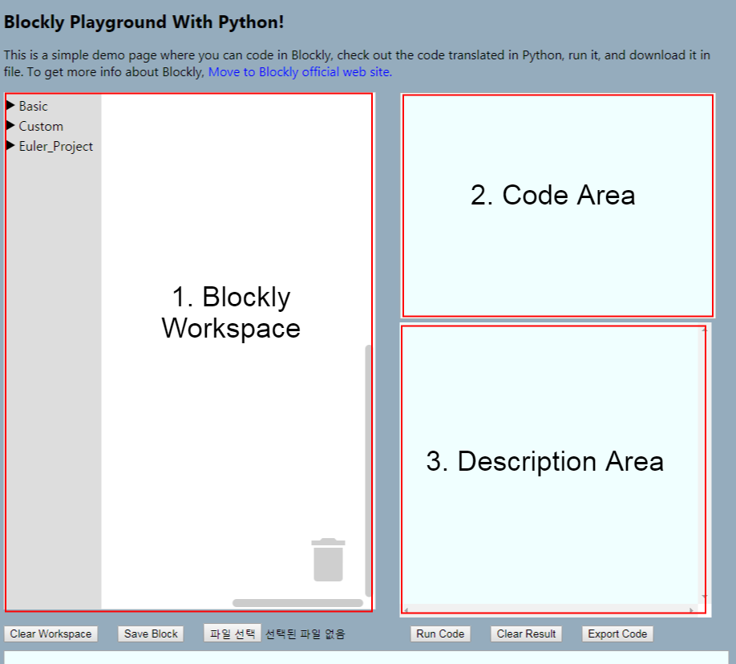

웹에서 Blockly 사용하기
========================================
Blockly는 웹, Android, iOS에서 모두 사용 가능하지만, 여기서는 웹 환경을 기준으로 하겠습니다. 

Blockly로 만든 블록과 editor(Workspace)를 웹에서 사용하기 위해서는 다음과 같은 단계를 거칩니다.

1. Blockly workspace를 삽입할 수 있는 웹 페이지를 준비한다.
2. XML 형식으로 workspace의 카테고리, 블록 구성 등을 설정한다.
3. 완성된 workspace를 웹 페이지에 inject한다.
4. 웹 페이지의 나머지 기능들을 구현한다.

한 단계씩 따라가 보겠습니다.

Blockly Playground
---------------------------------------

아래 사진은 Blockly 블록 구현과 적용을 위해 간단하게 만들어 본 Playground 페이지입니다. 전체 html 코드는 [여기](https://github.com/VleuDive/Blockly_Web-playground/blob/master/Webpages/test.html)에서 보실 수 있습니다. 사진에서 보시다시피, Blockly 사용에 꼭 필요한 기능만 추가해 놓았기 때문에 구조는 굉장히 단순합니다.



1. Blockly Workspace : 실제로 블록을 놓고 조합하며 사용할 수 있는 공간입니다. 이 문서에서는 이 부분을 구현하는 것을 중점적으로 다룹니다.
 
 2. Code Area : 이 부분에는 workspace에 올라온 블록들이 변환된 실제 코드가 나타납니다. Python을 기준으로 블록들을 정의했기 때문에, 일단은 이 부분에 파이썬 코드가 나타나도록 하였습니다.
 
 3. Description Area : 블록에 대한 상세 설명을 확인할 수 있는 부분을 구현했습니다. Workspace에 블록이 새로 생성되거나, 이미 생성되어 있는 블록이 클릭되었을 때 해당 블록에 대한 상세 설명이 여기에 표시됩니다.
 
 ### 필요한 파일 포함시키기
 
 웹 페이지에서 Blockly workspace를 만들기 위해서는 일단 관련 파일을 추가해 주는 구문이 필요합니다. 이 파일 추가는 HTML 파일의 ```<head>``` 구역 안에 ```<script src="파일 경로">``` 태그를 통해 추가할 수 있습니다. 정확한 코드는 다음과 같습니다.
 
 ```html
<script src="../blockly_compressed.js"></script>
<script src="../python_compressed.js"></script>
<script src="../blocks_compressed.js"></script>
```

(원본 코드에는 더 많은 파일이 추가되어 있지만 설명에 필요하지 않은 부분은 생략했습니다.)

첫 번째로 추가하는 **blockly_compressed.js**는 Blockly 자체의 설정과 관련된 파일입니다. Blockly 소스 코드를 다운받으면 패키지 안에 처음부터 들어 있는 파일 중 하나입니다.

두 번째 파일인 **python_compressed.js** 역시 처음부터 들어 있는 파일로, Python 언어 규칙 및 블록 변환과 관련된 내용을 압축해서 담고 있습니다. Python 이외의 다른 언어를 사용하고 싶으시다면 lua_compressed, dart_compressed와 같은 다른 파일을 사용하실 수 있습니다.

주의할 점은, **언어명_compressed.js 파일은 반드시 blockly_compressed.js 파일 바로 밑 줄에서 포함시켜야 한다**는 것입니다. Blockly 공식 가이드에서도 강조하고 있는 점으로, 이것을 지키지 않고 언어명_compressed.js를 포함시키는 코드를 blockly_compressed.js를 포함시키는 줄과 멀리 떨어뜨려 작성하게 되면 후에 코드 생성 및 변환 시 에러가 발생합니다.

세 번째 파일인 **blocks_compressed.js**도 기본 파일 중 하나로, 이 파일은 미리 정의되어 있는 기본 블록에 대한 설정을 모두 담고 있습니다. 이 파일이 없으면 Blockly에서 기본으로 제공하는 블록들을 workspace에 올려 사용하는 것이 불가능해집니다.

### Workspace 구성하기

Blockly Workspace는 기본적으로 정해진 모양이 있지만, 그것 외에 포함시킬 블록의 종류나 블록 카테고리 등은 코드를 통해 마음대로 정해 줄 수 있습니다.

이런 Workspace 설정은 XML 형태로 하게 되는데, 예제 페이지에서는 ```<xml>``` 태그 구역에 모든 내용을 기술했습니다. 다른 XML 파일로 분리하는 것도 가능합니다.

XML로 표현한 workspace 구조는 대략 다음과 같습니다.

```xml
<xml id="id로 사용할 이름" style="display:none">
    <category name="카테고리 이름">
        <block type="블록 타입(이름)"></block>
        <block type="블록 타입(이름)"></block>
                            .
                            .
                            .
    </category>
</xml>
``` 

이 XML구조는 후에 workspace inject 함수를 호출할 때 넘겨지게 됩니다. 일종의 설정파일처럼 사용되지요. 그렇기 때문에 display 속성은 none으로 설정합니다. 이 XML 구조 자체가 변환되어 보이는 것이 아니라, inject라는 함수의 파라미터로서 전달되어, 그 함수에서 이 XML 구조를 사용해 만들어낸 workspace가 눈에 보이게 되는 것이기 때문이지요.

**Category** 설정은 블록 여러 개를 하나의 카테고리로 묶어 더 손쉽게 관리할 수 있게 도와 줍니다. Workspace 내에서 사용하는 블록의 개수가 적을 때는 상관없지만, 개수가 많아지게 되면 어떤 블록이 있는지 한 눈에 알아보기 어렵기 때문에 카테고리를 사용해서 관리하는 것이 좋습니다. 위에 있는 Playground 페이지 스크린샷을 보면,"Basic","Custom","Project" 라는 큰 카테고리가 등록되어 있습니다.

카테고리 안에 서브 카테고리를 지정할 수도 있습니다. 이런 식으로 태그를 중첩해 사용하면 됩니다.

```xml
<category name="큰 카테고리 이름">
    <category name="작은 카테고리 이름">
                    .
                    .
                    .
    </category>
</category>
```

그 다음 단계는 카테고리에 블록을 추가하는 것입니다. 블록 추가는 **block** 태그로 할 수 있습니다. 이 때, block name이 아니라 **block type=**형태로 블록을 지정합니다. 여기서 type에는 블록을 정의할 때 정해 준 type명이 들어갑니다.

### 웹페이지에 Workspace Inject하기

Workspace를 정의했으니 이제는 실제로 웹페이지에 workspace를 삽입할 차례입니다. 페이지에 workspace를 삽입하는 함수는 ```<script>```태그 안에 Javascript로 정의되며, 다음과 같습니다.

```javascript
var demoWorkspace=Blockly.inject('blocklyDiv',{toolbox:document.getElementById('toolbox')});
```

여기서 **demoWorkspace**는 만들어 줄 workspace의 이름입니다. 후에 세이브 & 로드 등의 조작을 할 때 이 이름을 가지고 workspace를 지정하게 됩니다.

**Blockly.Inject()** 함수는 미리 정의된 workspace 설정을 가져와 웹 페이지 상에 실제로 삽입하는 함수입니다. 파라미터는 두 개를 받으며, 처음 파라미터는 workspace를 삽입할 html element의 id입니다. 여기서는 "blocklyDiv" 라는 div에 workspace를 삽입합니다. 두 번째 파라미터는 XML 설정을 가지고 오는 부분입니다. toolbox 라는 key에 XML element를 매칭해 가져오게 되지요. 여기서는 XML을 HTML 문서 내에 작성했으므로 document.getElementById() 함수를 이용해 해당 태그의 내용을 읽어 옵니다.

이 함수까지 호출하고 나면, 웹페이지에 Blockly workspace가 삽입됩니다. 이후 workspace가 원하는 위치에 제대로 삽입되었는지, 작동은 제대로 되었는지 테스트를 해 보면 웹에서의 Blockly 사용 준비는 끝납니다.
