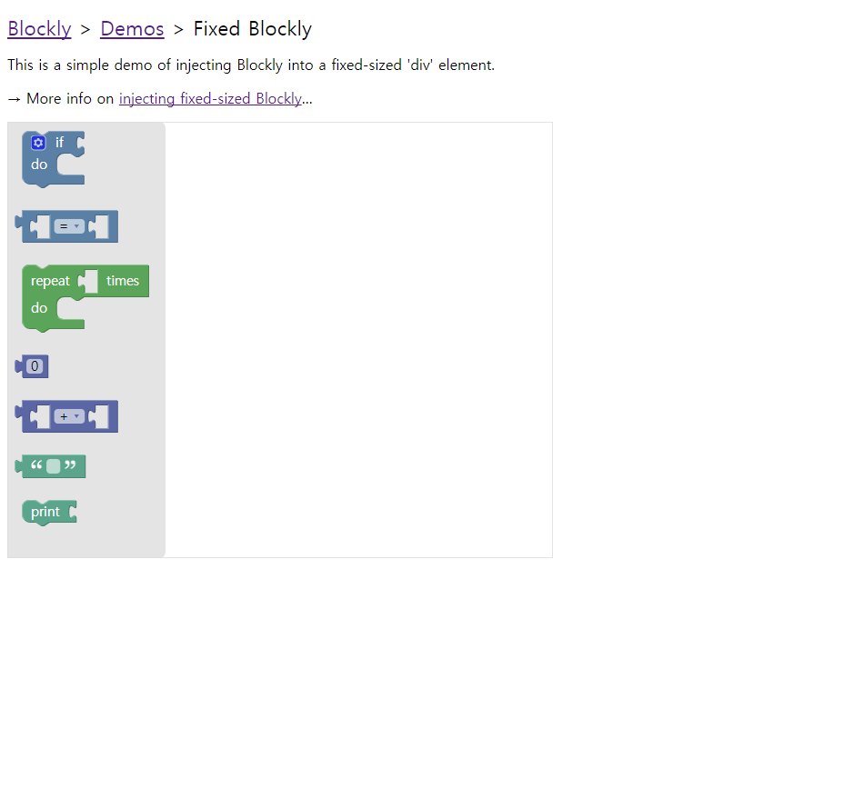

Blockly란?
===========================
Google이 만든 Blockly 라이브러리는 웹, ios, Android에서 구동하는 
블록 기반 프로그래밍 앱을 만들기 위해 사용됩니다.

주의하실 점은 **Blockly 라이브러리**는 개발자를 위한 도구이며,
우리가 흔히 알고 있는, '블록을 맞추어 프로그래밍을 할 수 있게 만든 플랫폼 또는 앱' 
은 **Blockly 어플리케이션(Blockly Apps)** 라고 불린다는 것입니다.

그 용도에 맞게, Blockly에서는 다양한 Default Block을 제공하며, 원한다면 얼마든지 
자신이 원하는 모양과 기능의 블록을 만들어 사용할 수 있습니다.

또한 위에서 언급한 것처럼, Blockly 앱은 현재 웹, ios, Android 상에서 구동 가능합니다. 이 시리즈에서는 웹 페이지 또는 웹 어플리케이션에서 구동하는 Blockly App을 만드는 것을 중심으로 설명하려 합니다. 참고로, 각
 환경에서 Blockly 라이브러리를 사용하는 방법이 조금씩 달라지니,
웹 이외의 환경에서 Blockly App을 개발하시려는 분들은[Blockly 공식 가이드(영문)](https://developers.google.com/blockly/guides/overview) 를 참고하실 수 있습니다.
 사실 개발 환경이 달라져도 기본 개요는 같지만 각 플랫폼에 맞게 용어나 코딩 방법 등이 달라집니다.
 
 Blockly 지원 언어
 ------------------------
 사용자가 보기에 Blockly가 만들어 낸 Block들은 코딩을 위해 만들어진 기초 코드 조각처럼 보이지만, 이 블록들은
 사실 실제 프로그래밍 언어로 된 코드가 매핑되어 있는 그래픽 요소 조각입니다. 
 Blockly 블록들은 기본적으로 **Javascript** 또는 **JSON array**로 그 형태가 만들어져 있으며, 각 블록마다 본격적인
고급 프로그래밍 언어로 되어 있는 코드가 매핑되어 있습니다.

Blockly 블록에 매핑할 수 있는 언어는 현재로서는 이 5가지입니다.

* Javascript
* Python
* PHP
* Lua
* Dart

블록마다 실제 실행 가능한 코드가 정해져 있기 때문에, 자신이 조합한
블록을 코드로 바꾸어 바로바로 확인하거나 실행하는 것도 가능합니다. 이에 대해서는
다른 항목에서 서술하겠습니다.

 Blockly 어플리케이션 개발 과정
 ------------------------------------
 Blockly 라이브러리는 개발자를 위한 라이브러리이며, 그것이 실제로 활용되기 위해서는
 이 라이브러리를 이용해 어플리케이션을 만들어 사용해야 합니다. 상술한 것처럼, Blockly
 어플리케이션은 웹, ios, Android의 3가지 플랫폼에 적용 가능합니다.
 
웹을 기준으로 보았을 때, Blockly Application을 만드는 기본 단계는 다음과 같습니다.
1. 웹 페이지를 만든다.
2. 만든 웹 페이지에 Blockly editor 를 삽입한다.
3. 필요한 custom block을 정의한다.
4. 만든 블록에 code generator를 붙여, 블록에 실제 프로그래밍 언어로 되어 있는 코드를 매핑한다.
5. 만든 블록을 editor에 추가한다.
6. 나머지 필요한 기능들을 구현한다.

Blockly 라이브러리 다운로드 및 시작하기(Web)
----------------------------------------------
Blockly는 기본적으로 오픈소스 라이브러리입니다. [Blockly 공식 Github 레포지터리](https://github.com/google/blockly)
에서 소스를 clone 해 사용할 수 있습니다. Blockly는 서버의 개입 없이 client-side 에서 작동하며, 대부분의 경우 별다른 3rd-party dependency를 필요로 하지 않기 때문에, 
이렇게 소스코드를 다운받는 것으로 준비는 끝납니다.

Blockly 레포지터리를 제대로 clone해 오셨다면 해당 폴더의 **demos/fixed/index.html**을 실행하여 작동 테스트를 해 볼 수 있습니다.
이렇게 환경 구축을 끝내고 나면, 이제 Blockly 라이브러리를 사용해 어플리케이션을 만들 준비가 된 것입니다.