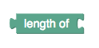
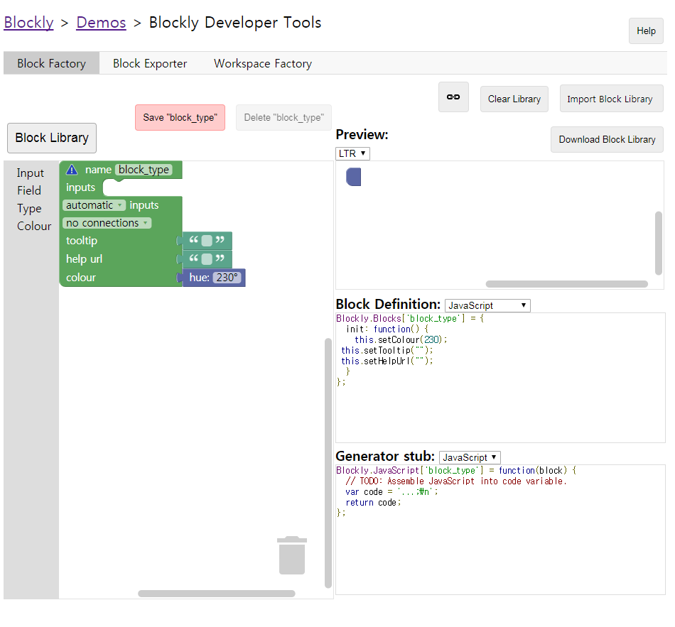

Blockly Custom Block 정의(개요)
==================================
Blockly의 장점은 기본 블록 외에도 어플리케이션이 필요로 하는 다양한 custom block을 마음껏
만들어 사용할 수 있다는 것입니다. Custom block을 만들려면 크게 다음과 같은 두 가지 단계를 거칩니다.
1. Block의 모양, 색깔,  다른 블록과의 결합 정보 등을 정의한다.
2. 만들어진 Block에 고급 언어로 된 코드를 매핑한다.

여기서는 첫 번째 단계인 Block definition의 방법을 대략적으로 설명하겠습니다.

Javascript vs. JSON
----------------------------------------
Blockly block은 크게 두 가지 방법으로 정의 가능합니다. 두 방법 모두 Javascript를
기반으로 하지만, 한 가지 방법은 처음부터 끝까지**Javascript** 스타일로 
블록 속성을 정의하는 한편, 다른 방법은 **JSON Array** 형식으로 블록 속성을 정의합니다.
간단한 예를 들어 보겠습니다.

이 블록은 String을 받았을 때 그 길이를 리턴해 주는 기능을 합니다.
Javascript 스타일과 JSON Array 스타일로 각각 이 블록을 정의해 보면 다음과 같습니다.

* Javascript 스타일

        Blockly.Blocks['string_length]={
        this.appendValueInput('Value')
            .appendField('length of')
            .setCheck('String');
        this.setOutput(true,"Number");
        this.setColour(160);
        this.setTooltip('tooltip for this block');
        this.setHelpUrl('http://.....');
        }
 
 (자세한 코드 해석은 다른 문서에서 다루겠습니다.)
 
 * JSON Array 스타일
        
        Blockly.defineBlocksWithJsonArray(
        [
            {
                "type":"string_length",
                "message0":"length of %1",
                "args0":[
                    {
                        "type":"input_value",
                        "name":"Value",
                        "check":"String"
                    }
                ],
                "output":null,
                "colour":160,
                "tooltip":"tooltip for this block",
                "helpUrl":"http://....."
            }
        ]);
  
 (역시 자세한 코드 해석은 다른 문서에서 다루겠습니다.)
 
 하나 주의하실 점은,
 JSON array 형태로 블록 정의를 할 때, **파일 형태를 .json으로 하면 안 된다**는 것입니다.
JSON array 형태로 정의할 때도 정의가 들어 있는 파일의 확장자는 **.js** 이며, Javascript 파일 내에서
**Blockly.defineBlocksWithJsonArray()** 함수의 파라미터로 블록의 정의가 담긴 JSON array를 넘겨 주는 형태입니다.

후술할 Blockly Developer Tools 에서는 이 함수 없이 JSON array만 달랑 생성해 주기 때문에 처음에는 헷갈릴 확률이 매우 높습니다.

정리하자면, Block 정의는 JSON 원본 파일 안에 담는 것이 아니고, Javascript 파일 안에, Javascript로 구현된 Blockly 라이브러리의 함수에 파라미터로 전달되는 것입니다.

어떤 형태로 정의하는 것이 나은가?
---------------------------------
결론부터 말하면, Google 공식 문서에서는 **JSON array 형태의 정의를 권장**합니다.
일단 Cross-platform 형식인데다가, 다양한 언어권에서 블록을 정의할 때 표준으로 사용하기 훨씬 적합하기 때문이지요.

다만, 예외는 있습니다.

다른 문서에 따로 서술할 Mutator, Extension과 같은 고급 기능을 사용해야 할 때는, JSON array가 아니라
Javascript로 구현하는 것이 낫습니다. 사실 Mutator의 경우 간단한 형태일 때는 JSON array와 Javascript 형식을 적절히 섞은 형태로 
정의하는 쪽으로 기울고 있긴 하지만, 많이 복잡한 형태가 될 경우에는 아직도 Javascript만으로 정의하는 것이 더 편합니다. JSON은 아주 복잡한 추가 기능을
표현하지 못하기 때문입니다.

이렇게 각 방법에 장단점이 있으므로, 양쪽 방법 모두를 숙지하고 필요할 때마다 적절히 섞어 쓰는 것이 필요합니다.
실제로 기본으로 제공되는 Blockly 라이브러리 소스코드를 보아도, 각 블록의 특성에 따라 다른 방식을 사용하여 정의한
것을 볼 수 있습니다.

Blockly Developer Tools
-----------------------------
원래 블록 정의는 코딩만으로 충분히 가능하기는 하지만, 코딩만으로는 지금 만들고 있는 블록이 어떤 모양이 될지,
결합부는 제대로 만들어졌는지, 색깔은 어떤지 가늠하기 어렵습니다. 그래서 만들어진 것이 [Blockly Developer tools]("https://blockly-demo.appspot.com/static/demos/blockfactory/index.html") 입니다.

이 페이지에서는 이미 정의된 component를 이용하여 시각적인 방법으로 블록 정의를 할 수 있습니다.
만들어지는 블록의 모습을 Preview 창에서 실시간으로 확인할 수 있고, Block Definition이나 Generator Stub 창에서는 Block definition과
Code generation을 위한 코드도 생성해 주기 때문에 구문이 헷갈리거나 복잡한 코딩을 하기 싫을 때 아주 유용하게 사용할 수 있습니다.

또한 이 툴에서는 Block Exporter 와 Workspace Factory 같은 기능도 제공하기 때문에, Block을 자신이 만든 editor에 추가하고 웹 페이지에
올리는 작업도 훨씬 쉽게 할 수 있습니다.

단, 이 좋은 도구에도 단점은 있습니다. 바로 **완전한 코드를 생성해 주지 않는다**는 것입니다.
상술했듯이, Block Definition과 Generator Stub창에서 생성된 코드를 볼 수 있고 Block Exporter 기능을 통해 코드 다운로드도 가능하지만,
이 코드를 그대로 사용하면 오류가 발생합니다. 완성된 코드가 아니기 때문이지요.

Block Definition에서 생성해 주는 코드는 Javascript 포맷의 경우 제대로 완성되어 있지만, JSON Array 포맷의 경우
문자 그대로 '달랑 JSON array만' 생성해 줍니다. 위에서 설명한 Blockly.defineBlocksWithJsonArray() 같은 함수를 추가하고
이를 .js 파일에 저장하는 것은 개발자가 할 일이지요.

Generator stub의 경우, 정작 중요한 code를 완성시켜 주지 않습니다. 원하는 언어로 코드를 매핑하려면 이 부분에서
만들어 준 코드를 참고하여 직접 코드 조각을 만들어 매핑시켜야 합니다.

이런 점들만 주의하신다면 Blockly Developer Tools는 Blockly 라이브러리를 사용할 때 매우 훌륭한 도구가 되어 줄 수 있습니다.
