Blockly Input Types
================================
Blockly 커스텀 블록의 형태에는 여러 가지가 있습니다. 보통 Input 과 Output이 어떤 것이냐, Connection의 형태는 어떻냐에 따라 블록의 모양이 달라집니다.

제일 먼저 Blockly 블록의 input과 output, 그리고 connection이 무엇인지 정의해 보면 이렇습니다.

* Input: 블록의 '빈 칸'입니다. 여기에 다양한 값 또는 명령과 매핑되는 블록들이 붙어,전체 구문을 완성시킵니다. Input 은 블록의 특성에 따라 여러 개일 수도, 한 개만 있을 수도 있습니다.
또한 input은 크게 **Dummy Input, Value Input, Statement Input**의 세 가지 타입으로 나누어집니다. 이 세 가지 타입과 별개로, input을 가지는 블록은 블록 정의 시에 정하게 되는 'check'라는 요소를 가지며, 이 'check'에는 어떤 자료형(ex: String, Number...)의 input이 와야 할지를 정해 줄 수 있습니다.
 

* Output: 블록의 왼쪽으로 나와 있는 '돌출부' 입니다.
한 블록의 output은 다른 블록의 value input으로 들어갈 수 있습니다. Output은 connection의 양상이나 블록의 특성에 따라 생략 가능하지만, input과는 다르게 여러 개를 지정할 수는 없습니다.
Input에 check라는 특정 타입을 설정할 수 있는 것처럼, output의 형태 또한 정의할 수 있습니다. 역시 블록 생성 시에 정의되며, String, Number 등을 정해 줄 수 있습니다.


* Connection : 한 블록과 다른 블록의 '연결 상태'를 나타냅니다. Connection의 종류에는 다음과 같은 것이 있습니다.
    * No connections: 문자 그대로 다른 어떤 블록과도 연결되지 않는 블록의 경우입니다. 블록의 모양은 다음과 같습니다.
    
    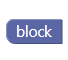
    
    * Top+Bottom connections: 해당 블록의 위 아래에 다른 블록이 붙을 수 있는 형태입니다. 블록의 모양은 다음과 같습니다.
    
    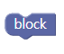
    
    * Top connection: 해당 블록의 위에만 다른 블록이 붙습니다. 블록의 모양은 다음과 같습니다.
    
    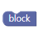
    
    * Bottom connection: 해당 블록의 아래에만 다른 블록이 붙습니다. 블록의 모양은 다음과 같습니다.
    
    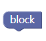
    

Input의 종류
-------------------------------
상술했듯이, Blockly 블록의 Input에는 **Dummy Input, Value Input, Statement Input**의 세 가지가 있습니다.
모두 성격이나 역할이 다르기 때문에 블록의 목적이나 특성에 따라 다른 타입의 Input이 사용되고, 한 블록에 여러 가지 종류의 Input이 함께 쓰이는 경우도 빈번합니다.

###Dummy Input
이 타입의 input은 블록과 직접적으로 연결되는 것이 아니며 특정한 피연산자나 값을 나타내는 input도 아닙니다. 값을 직접 나타내는 것은 아니지만 블록의 이름을 나타내는 label을 담거나, 선택 가능한 목록을 나타내는 dropdown menu field를 추가하거나, external input을 받을 때 강제개행과 비슷한 용도로 쓰이는 등 다양한 용도로 쓰이지요.
한 마디로 말하면 보조적인 역할을 하는 요소라 할 수 있지만, 한편으로는 블록의 모양이나 성질을 구성하는 데 있어서 중요한 역할을 하는 input입니다.
실제로 모양을 가지고 보여지는 블록이 아니기 때문에 특별한 형태는 없습니다.

###Value Input
Value input은 value input을 가진다고 정의된 블록과 결합할 수 있습니다. 실제 피연산자나 값을 나타내며, 주로 함수의 파라미터 등으로 들어갑니다.
또한 이 타입의 input은 output을 가지는 짧은 블록의 형태로 정의되는 경우가 많습니다. 보통 이런 모양입니다.

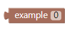           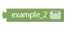

Value Input의 사용 시 주의하실 점은, **Block 정의 시 정해 준 자료형이 아닌 다른 자료형의 input은 해당 블록에 연결할 수 없다**는 것입니다. 즉, input으로 String 형태만 받기로 정의된 블록에 Number를 output으로 가지는 value input이 결합할 수 없다는 것입니다.
하지만 실제로 editor에서 타입이 맞지 않는 input과 block을 연결하려고 하면 제대로 붙지 않고 한쪽 블록이 튕겨져 나가 버리므로, 실제 사용 시에는 타입이 맞는 연결인지 여부를 바로 알 수 있습니다.


###Statement Input
일부 블록의 경우, value 대신 statement를 input으로 받기도 합니다. 이때 statement는 '구문'에 가깝게 번역되며, 해당 블록의 범위 내에서 다시 실행되어야 하는 서브 동작을 나타냅니다. 통상적인 고급 언어에 대입해 보면, if문이나 for 문, while 문, 함수 정의 시 중괄호 안쪽이나 콤마(:) 아래쪽에 들여쓰기로 들어가게 되는 하부 동작과 같다고 할 수 있습니다.
블록의 형태를 중심으로 보았을 때, statement input을 나타내는 블록들은 주로 output이 아닌 conncetion을 가지며, Top+Bottom connection을 가지도록 정의되는 경우가 많습니다. 또한 statement input을 가지는 블록은 아래 왼쪽 그림과 같이 생겼으며, statement input과 결합할 경우 아래 오른쪽 그림과 같은 모양이 됩니다.

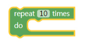               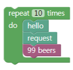 

이렇게 결합시켜 놓은 블록들은 전체가 한 그룹으로 움직입니다. (Value input이 필요한 블록에 해당 input을 결합시켰을 때에도 마찬가지입니다.) 그렇기 때문에 editor 상에서 statement input의 전체 모음을 감싸고 있는 외곽 블록을 움직이면 전체 그룹이 같이 움직이고, 끼워 넣은 statement input 중에 정의 또는 code generation 코드가 잘못된 것이 있다면 해당 그룹에 있는 다른 블록들에까지 영향을 미쳐 전체 그룹의 코드가 제대로 만들어지지 않기도 합니다.


Fields
-------------------------------------------
Blockly에는 field라는 개념도 존재합니다. 이 field들은 블록에 다양한 UI요소를 붙여, 블록을 좀 더 쉽고 가시적인 방법으로 다룰 수 있게 해 줍니다. 
보통 field를 사용할 때는 **dummy input과 함께 사용하는 편**입니다. (Blockly Developer Tools에서 확인해 보면 dummy input에 field 블록이 물려 있는 형태를 하고 있습니다.) 이 특성은 JSON array로 블록을 정의할 때보다 Javascript 스타일로 정의할 때 더 확연히 드러나는 편인데, 자세한 점은 다른 문서에서 서술합니다. 
Blockly에서 사용하는 field에는 다음과 같은 것들이 있습니다.

###label
말 그대로 라벨로 사용하는 field입니다. Label은 굉장히 자주 쓰이는 field입니다. 블록의 이름이나, 블록 자체에 표시되는 간단한 설명문 등은 모두 이 label을 사용하여 만들어집니다. 이처럼 활용성이 좋기 때문에, label field는  
아예 자신만의 notation이 따로 있습니다. 코드를 보면 더 확실히 이해가 가실 것입니다. 블록 정의는 JSON array 스타일을 기준으로 하겠습니다.

이 예제에서 정의할 블록은 다음과 같이 생겼습니다. 간단한 라벨 두 개를 가지고 있는 블록이지요.

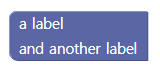

정의에 사용하는 Javascript 함수는 생략하고 블록의 속성을 정의하는 JSON array 부분만 살펴보겠습니다.

```javascript
{
  "type":"example_label",
  "message0": "a label %1 and another label",
  "args0":[
    {
      "type":"input_dummy"
    }
  ]
}
```
기본적으로 label field는 이런 식으로 사용할 수 있습니다. 'message0' 부분에 placeholder인 %1을 넣어 이 자리에 dummy input이 들어간다는 것을 나타내고 있습니다. 여기서 dummy input은 블록 내에서의 줄 바꿈을 위해 사용되고 있습니다. 
label의 이름과 내용은 따로 정의하지 않고, message0 부분에 한 줄로 정의했습니다.
다른 문서에서 더 자세히 서술하겠지만, label과 label 사이에 input이 들어갈 경우는 이런 식으로 placeholder를 사용합니다.

또 다른 스타일의 label 사용 방법을 보겠습니다.

```javascript
{
  "type": "example_label",
  "message0":"%1 %2 %3",
  "args0":[
    {
      "type":"field_label",
      "text":"a label"
    },
    {
      "type":"input_dummy"
    },
    "and another label"
   ]
}
```
여기에서는 message0 부분이 전부 placeholder로 정의되어 있습니다. 이 자리를 각각 field_label, dummy input, "and another label"이라는 string이 순서대로 채우는 형태입니다.
먼저 "args0" 배열의 첫 번째 부분인 "field_label" 정의 부분을 보면, "input_dummy" 등을 사용하지 않고 곧바로 field 타입인 "field_label"을 사용한 것을 볼 수 있습니다. Label처럼 자주 쓰이는 field들은 상술했듯이 자신만의 notation이 있기 때문에 이런 식으로 정의하는 것도 가능합니다.
배열의 그 다음 부분에서는 dummy input을 넣어 줄바꿈을 표현하고 있습니다. 주목해야 할 것은 세 번째 부분입니다. 중괄호로 묶지도 않고, key도 부여하지 않은 채 그저 string 한 줄만 달랑 정의되어 있습니다.
사실 Label은 이런 식으로 정의하는 것도 가능합니다. 아무 형식 없는 plain string을 전달해 주면, 그 string은 label로 해석됩니다. 단, 이렇게 넣어 줄 수 있으려면 message0의 value를 정해 줄 때 해당 string이 들어갈 수 있는 placeholder를 넣어 주어야 합니다.

또한, 위의 코드에서 "a label" 라벨을 정의한 방식으로 명시적으로 label을 정의할 경우, "type","text" 외에도 "style"이라는 키를 추가하여 라벨에 CSS 기반 스타일을 부여할 수도 있습니다.


###Image


이 field는 문자 그대로, 블록에 아이콘 등의 이미지를 삽입하기 위해 사용합니다. Image field가 삽입될 경우, image의 크기에 맞추기 위해 블록의 크기가 자동으로 변경됩니다.
Image의 경우도 label과 마찬가지로 자신만의 indicator를 따로 가지기 때문에, placeholder만 마련되어 있다면 바로 "field_image" 형태로 블록에 삽입할 수 있습니다.
이미지 URL은 상대 경로로 지정해 줄 수 있으며, 웹 상에 있는 이미지를 URL을 이용해 바로 접근해 삽입하는 것도 가능합니다. 

Image field는 독특하게도  "alt"라는 독특한 요소를 가지고 있는데, 이것은 오류로 인해 이미지가 표시되지 않거나, 접근성을 고려해야 하는 상황에서 이미지 대신에 표시될 수 있는 설명문을 말합니다. 어떤 이유에서든 이미지를 표시할 수 없는 상황이 되면, 자동으로 "alt" 에 지정된 string이 대신 출력됩니다.


###Dropdown
여러 항목 중 하나를 선택할 때 사용되는 drop-down field입니다. Input의 값보다는, block이 나타내는 연산에 설정해 줄 옵션 등을 선택하는 데 주로 사용됩니다. Dropdown field를 정의하는 코드는 다음과 같습니다.
역시 함수는 제외하고 블록 설정을 나타내는 JSON array만 표시하겠습니다.

```javascript
{
  "type": "example_dropdown",
  "message0": "drop down: %1",
  "args0": [
    {
      "type": "field_dropdown",
      "name": "FIELDNAME",
      "options": [
        [ "first", "ITEM1" ],
        [ "second", "ITEM2" ]
      ]
    }
  ],
  "colour":290
}
```

이 코드가 정의하는 블록의 모습은 대략 이렇습니다.

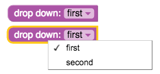

Dropdown 옵션으로 'first','second'를 가지고 있는 것을 볼 수 있습니다. 이런 dropdown option은 JSON array 내에서는 리스트의 형태로 나타납니다. 

```javascript
       [ "first", "ITEM1" ],
       [ "second", "ITEM2" ]
```

이런 식입니다. 리스트의 앞 부분에 있는 원소 "first"와 "second"는 블록 사용자가 실제로 보게 될, 즉 dropdown field 내에 실제로 표기되는 이름이고 두 번째로 오는 "ITEM1"과 "ITEM2" 는 코드 상에서 사용하는 이름입니다.
**사용자는 앞에 오는 이름(실제 표기되는 이름)을 보고 선택을 하지만, 코드 상에서 조건 등을 설정할 때는 코드 상의 이름(두 번째 이름)으로 각 option을 식별합니다.** 
이처럼 사용자가 실제 선택하는 이름과 코드 상에서 사용되는 indicator가 다르므로, 헷갈리지 않도록 주의해야 합니다. 또는 아예 양쪽 이름을 똑같이 설정해 주는 것도 방법입니다.

###그 외의 field
* Checkbox

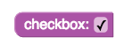

클릭으로 toggle할 수 있는 checkbox를 블록 내에 삽입할 때 사용하는 field입니다. 이 field에서는 true와 false로 표현되는 boolean 값을 얻을 수 있습니다.

* Colour picker

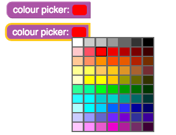

 색상 선택 패널을 표시해 주는 field입니다. 웹 환경에서라면 Javascript 코드를 약간 조작해 아래 사진과 같이 기본으로 표시되는 색상 패턴 외에 다른 색상 배치를 가지는 패널을 표시하게 할 수도 있습니다.
 
 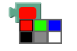
 
* Variable

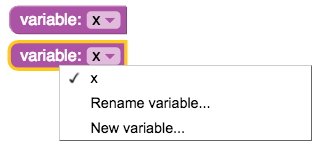

Blockly 역시 코딩에 사용되기 때문에 변수를 쓸 일이 생깁니다. Variable field는 이런 variable을 input으로 받는 블록에 사용됩니다. 이런 블록에 variable input을 결합하는 기본 방법은 미리 만들어진 variable block을 하나하나 끌어와 원래 블록에 붙이는 것인데, 꽤 번거로운 과정이므로 variable field를 이용해 input 입력 과정을 단순화할 수 있습니다.
Variable field는 dropdown field와 꽤 흡사하게 생겼지만 기능은 다릅니다. 먼저 이 field에는 정의 시에 기본으로 넣어 준 variable의 이름이 우선적으로 표시되며, 새 variable을 만들 수 있는 기능과 variable의 이름을 바꿀 수 있는 기능을 지원합니다.

* Angle

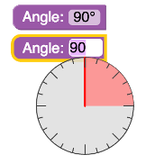

각도를 지정할 때 사용되는 field입니다.  Field를 클릭 시 360도까지 지정 가능한 각도기 모양이 출력되며, 이 각도기 모양 위에서 마우스 커서를 이동하여 숫자 입력 없이 직관적으로 각도를 입력할 수 있습니다.

* Date

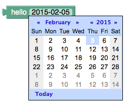

날짜를 지정할 때 사용되는 field입니다. Field를 클릭 시 달력 UI가 출력되며, 이 달력에서 날짜를 선택할 수 있습니다. 하지만 이 field는 Blockly의 기본 컴파일 목록에는 들어 있지 않습니다. (자주 쓰지도 않고, 기능이 복잡한 편이기 때문입니다.) 그렇기 때문에 date field를 사용하려면 프로젝트 상단에 **goog.require('Blockly.FieldDate')** 를 추가해 주어야 합니다.